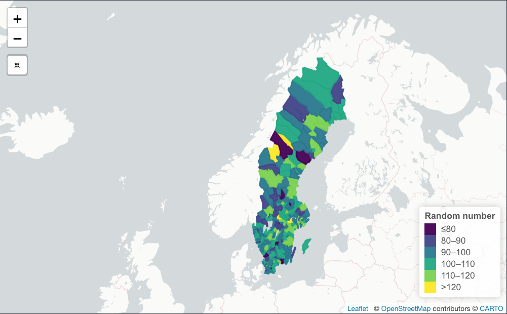
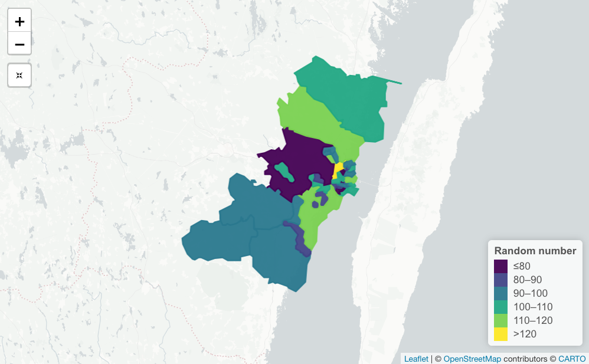

```{r setup, include=FALSE}
knitr::opts_chunk$set(echo = TRUE)
```

# swemaps2

The `swemaps2` package provide map objects to easily make beautiful maps of Sweden in R. 

```{r echo=FALSE, message=FALSE, warning=FALSE}
library(swemaps2)
library(tidyverse)
library(sf)

county %>% 
  mutate(rn = rnorm(nrow(.), mean = 100, sd = 10)) %>% 
ggplot(aes(fill = rn)) +
  geom_sf(show.legend = FALSE) +
  ggthemes::theme_map() +
  scale_fill_viridis_c(option = "magma")
```

This is the successor of [`swemaps`](https://github.com/reinholdsson/swemaps) by @reinholdsson

## Installation

You can install the package from github:

```{r eval=FALSE}
remotes::install_github("filipwastberg/swemaps2")
```

## Country maps

`swemaps2` contain simple features (sf) objects that make it easy to create maps over Sweden.

You can use these basic sf-objects to combine with data from SCB (using the [pxweb package](http://ropengov.github.io/pxweb/)) or Kolada (using the [rKolada package](https://github.com/lchansson/rKolada)).

```{r}
county
```

Using these objects it is easy to use ggplot to create beautiful maps for counties (Län) and municipality (Kommun):

```{r}
library(swemaps2)
library(tidyverse)
library(ggthemes)

county %>% 
  mutate(random_number = rnorm(nrow(.), mean = 100, sd = 10) ) %>% 
ggplot(aes(fill = random_number)) +
  geom_sf() +
  scale_fill_viridis_c()
```

Municipality (kommun):

```{r}
municipality %>% 
  mutate(random_number = rnorm(nrow(.), mean = 100, sd = 10) ) %>% 
ggplot(aes(fill = random_number)) +
  geom_sf() +
  scale_fill_viridis_c()
```

Using a package like `leaflet` and `simplevis` you can create interactive maps:

```{r eval=FALSE}
library(simplevis)

municipality %>% 
  mutate(random_number = rnorm(nrow(.), mean = 100, sd = 10)) %>% 
  leaflet_sf_col(col_var = random_number)
```
```{r echo=FALSE}

```

The regional FA Region maps are also included:

```{r}
fa_region %>% 
  mutate(random_number = rnorm(nrow(.), mean = 100, sd = 10) ) %>% 
ggplot(aes(fill = random_number)) +
  geom_sf() +
  scale_fill_viridis_c()
```


## DeSO and RegSO

Statistics Sweden has two demographic maps that you can load using the `load_deso()` and `load_regso()` functions. These objects are big and works best if you first filter them.

```{r}
deso <- load_deso()

deso %>% 
  filter(kommunnamn == "Kalmar") %>% 
  mutate(random_number = rnorm(nrow(.), mean = 100, sd = 10)) %>% 
  ggplot(aes(fill = random_number)) +
  geom_sf() +
  labs(
    title = "Map over Kalmar"
  )
```

```{r eval=FALSE}
deso %>% 
  filter(kommunnamn == "Kalmar") %>% 
  mutate(random_number = round(rnorm(nrow(.), mean = 100, sd = 10), 0)) %>% 
  leaflet_sf_col(col_var = random_number)
```

```{r echo=FALSE}

```

## City maps
### Stockholm
In addition there are maps for the three largest Swedish cities Stockholm, Göteborg and Malmö.

The Stockholm map, for example, also has some additional population data:

```{r}
ggplot(sthlm, aes(fill = kvinnor_45)) +
  geom_sf() +
  scale_fill_viridis_c() +
  labs(
    title = "Stockholm women 45",
    caption = "Source: https://dataportalen.stockholm.se"
  )
```

## Göteborg

Gothenburg has the largest map:

```{r}
ggplot(gbg, aes(fill = area_km2)) +
         geom_sf() +
  scale_fill_viridis_c() +
  labs(
    title = "Gothenburg by area size",
    caption = "Source: http://statistikdatabas.goteborg.se/pxweb/sv/"
  )
```

## Malmö

```{r}
ggplot(malmo, aes(fill = area)) +
  geom_sf() +
  scale_fill_viridis_c() +
  labs(
    title = "Malmö by area size",
    caption = "Source: https://malmo.dataplatform.se/"
  )
```


