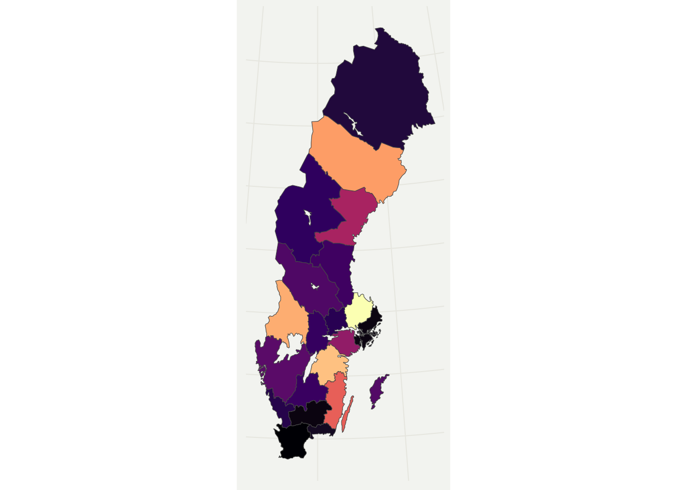
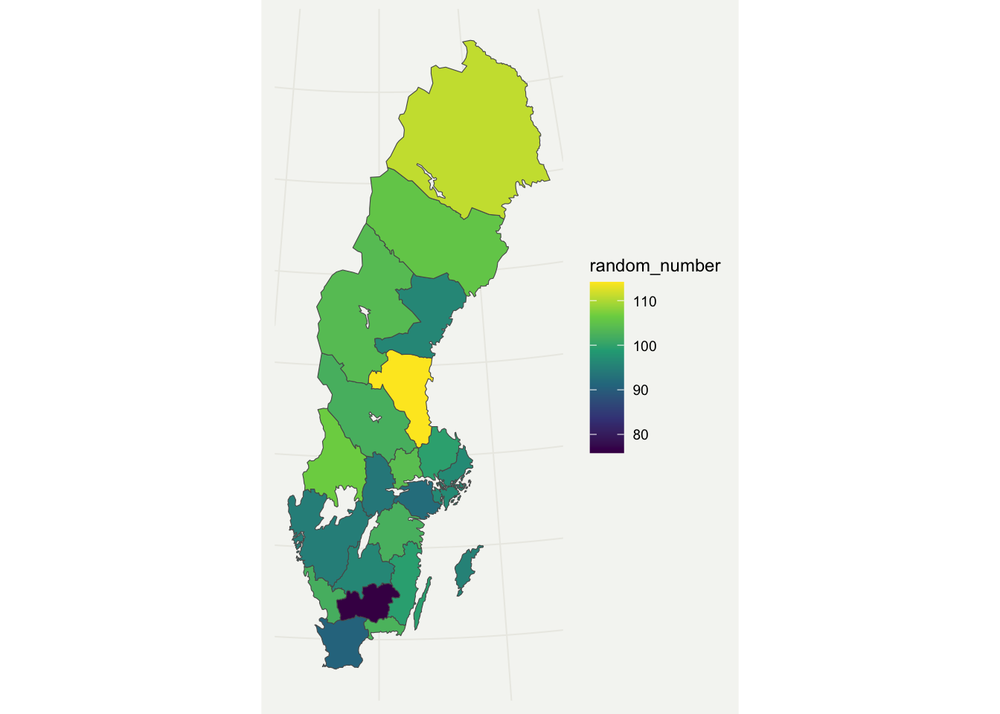

# swemaps2

The `swemaps2` package provide map objects to easily make beautiful maps
of Sweden in R.



This is the successor of
[`swemaps`](https://github.com/reinholdsson/swemaps) by
[reinholdsson](https://github.com/reinholdsson)

## Installation

You can install the package from github:

``` r
remotes::install_github("filipwastberg/swemaps2")
```

## Country maps

`swemaps2` contain simple features (sf) objects that make it easy to
create maps over Sweden.

You can use these basic sf-objects to combine with data from SCB (using
the [pxweb package](http://ropengov.github.io/pxweb/)) or Kolada (using
the [rKolada package](https://github.com/lchansson/rKolada)).

``` r
county
#> Simple feature collection with 21 features and 2 fields
#> Geometry type: MULTIPOLYGON
#> Dimension:     XY
#> Bounding box:  xmin: 277247.6 ymin: 6133891 xmax: 917271.4 ymax: 7669870
#> Projected CRS: SWEREF99 TM
#> # A tibble: 21 × 3
#>    ln_kod ln_namn                                                       geometry
#>    <chr>  <chr>                                               <MULTIPOLYGON [m]>
#>  1 01     Stockholms    (((627791.9 6569168, 630226.6 6572122, 631290.7 6570364…
#>  2 03     Uppsala       (((633496.1 6610607, 632895.2 6609547, 637045.2 6601261…
#>  3 04     Södermanlands (((555102.6 6536546, 549484.9 6540210, 548399.8 6543139…
#>  4 05     Östergötlands (((496094.6 6443310, 493792.5 6438720, 485582.7 6436950…
#>  5 06     Jönköpings    (((498999.7 6421417, 500271.5 6417129, 504533.5 6412062…
#>  6 07     Kronobergs    (((504095.5 6338410, 505156.2 6340178, 509340.4 6339948…
#>  7 08     Kalmar        (((544656.8 6325506, 540241.9 6327303, 537963 6332166, …
#>  8 09     Gotlands      (((706606.9 6415775, 709951.4 6417040, 712659 6417968, …
#>  9 10     Blekinge      (((473443 6228381, 472071.2 6231138, 468594.2 6230492, …
#> 10 12     Skåne         (((420135.8 6254456, 425339.2 6256685, 430337.3 6256572…
#> # … with 11 more rows
```

Using these objects it is easy to use ggplot to create beautiful maps
for counties (Län) and municipality (Kommun):

``` r
library(swemaps2)
library(tidyverse)
library(ggthemes)

county %>% 
  mutate(random_number = rnorm(nrow(.), mean = 100, sd = 10) ) %>% 
ggplot(aes(fill = random_number)) +
  geom_sf() +
  scale_fill_viridis_c() +
  theme_swemap2()
```



Municipality (kommun):

``` r
municipality %>% 
  mutate(random_number = rnorm(nrow(.), mean = 100, sd = 10) ) %>% 
ggplot(aes(fill = random_number)) +
  geom_sf() +
  scale_fill_viridis_c() +
  theme_swemap2()
```


Using a package like `leaflet` and `simplevis` you can create
interactive maps:

``` r
library(simplevis)

municipality %>% 
  mutate(random_number = rnorm(nrow(.), mean = 100, sd = 10)) %>% 
  leaflet_sf_col(col_var = random_number)
```


The regional FA Region maps are also included:

``` r
fa_region %>% 
  mutate(random_number = rnorm(nrow(.), mean = 100, sd = 10) ) %>% 
ggplot(aes(fill = random_number)) +
  geom_sf() +
  scale_fill_viridis_c() +
  theme_swemap()
```


## DeSO and RegSO

Statistics Sweden has two demographic maps that you can load using the
`load_deso()` and `load_regso()` functions. These objects are big and
works best if you first filter them.

``` r
deso <- load_deso()
#> Reading layer `DeSO_2018_v2' from data source 
#>   `/private/var/folders/pn/9hhpnpd15_d2k3qp5k814nnh0000gq/T/RtmpKO9DMH/deso_2018_2021-10-21/DeSO_2018_v2.gpkg' 
#>   using driver `GPKG'
#> Simple feature collection with 5984 features and 7 fields
#> Geometry type: POLYGON
#> Dimension:     XY
#> Bounding box:  xmin: 266646.3 ymin: 6132476 xmax: 920877.4 ymax: 7671055
#> Projected CRS: SWEREF99 TM

deso %>% 
  filter(kommunnamn == "Kalmar") %>% 
  mutate(random_number = rnorm(nrow(.), mean = 100, sd = 10)) %>% 
  ggplot(aes(fill = random_number)) +
  geom_sf() +
  labs(
    title = "Map over Kalmar"
  ) +
  theme_swemap2()
```


``` r
deso %>% 
  filter(kommunnamn == "Kalmar") %>% 
  mutate(random_number = round(rnorm(nrow(.), mean = 100, sd = 10), 0)) %>% 
  leaflet_sf_col(col_var = random_number)
```


## City maps

### Stockholm

In addition there are maps for the three largest Swedish cities
Stockholm, Göteborg and Malmö.

The Stockholm map, for example, also has some additional population
data:

``` r
ggplot(sthlm, aes(fill = kvinnor_45)) +
  geom_sf() +
  scale_fill_viridis_c() +
  labs(
    title = "Stockholm women 45",
    caption = "Source: https://dataportalen.stockholm.se"
  ) +
  theme_swemap2()
```


## Göteborg

Gothenburg has the largest map:

``` r
ggplot(gbg, aes(fill = area_km2)) +
  geom_sf() +
  scale_fill_viridis_c() +
  theme_swemap2() +
  labs(
    title = "Gothenburg by area size",
    caption = "Source: http://statistikdatabas.goteborg.se/pxweb/sv/"
  )
```


## Malmö

``` r
ggplot(malmo, aes(fill = area)) +
  geom_sf() +
  scale_fill_viridis_c() +
  theme_swemap2() +
  labs(
    title = "Malmö by area size",
    caption = "Source: https://malmo.dataplatform.se/"
  )
```


