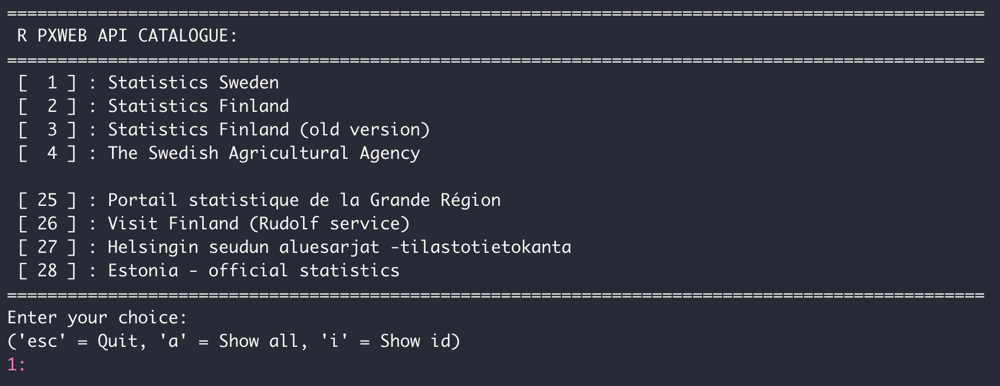

```{r setup, include=FALSE}
knitr::opts_chunk$set(
  collapse = TRUE,
  comment = "#>",
  echo = TRUE,
  warning=FALSE,
  message=FALSE,
  out.width = "100%"
)
```

## County & Municipality

Statistics Sweden (SCB) have a lot of interesting statistics that can be analyzed on a geographical level. Through their Database [Statistikdatabasen](http://www.statistikdatabasen.scb.se/pxweb/sv/ssd/) you can download the data as Excel tables. Even better, you can use the R Open Gov package [pxweb](http://ropengov.github.io/pxweb/) to query data from SCB.

By running `pxweb_interactive()` you can interactively choose which data to query. In this case we're going to use data from Statistics Sweden.

```{r eval=FALSE}
library(pxweb)

pxweb_interactive()
```

```{r echo=FALSE}

```

When you have clicked through which data you want to query you can get the call to the database as R code. In the code below I have manipulated the code that was returned by `pxweb` to only query `county codes` that are in `swemaps2::county`.

The data queried here is population count with higher education.

```{r}
library(pxweb)
library(janitor)
library(swemaps2)
library(tidyverse)

pxweb_query_list <- 
  list("Region"=county$ln_kod,
       "Kon"=c("1+2"),
       "ContentsCode"=c("BE0101U1"),
       "Tid"=c("2021"))

# Download data 
px_data <- 
  pxweb_get(url = "http://api.scb.se/OV0104/v1/doris/sv/ssd/BE/BE0101/BE0101C/BefArealTathetKon",
            query = pxweb_query_list)

# Convert to data.frame 
px_data_frame <- as.data.frame(px_data, column.name.type = "text", variable.value.type = "text")

population_per_kvm <- px_data_frame |> 
  clean_names()
```

Unfortunately, we do not get the region codes from SCB. But if we remove the `" län` from the region names we can join it by name:

```{r}
population_per_kvm <- population_per_kvm %>% 
  mutate(region = str_replace(region, " län", "")) 

county_pop <- left_join(county, population_per_kvm, by = c("ln_namn" = "region"))

county_pop
```

We can now easily visualize this data on a Swedish map

```{r fig.width=8}
library(scales)
ggplot(county_pop, aes(fill = log10(invanare_per_kvadratkilometer))) +
  geom_sf() +
  theme_swemap2() +
  scale_fill_viridis_c(option = "magma", labels = number) +
  labs(
    title = "",
    fill = "log10(population\nper square meter)",
    caption = "Source: SCB"
  )
```

We can also create an interactive map with `simplevis` 

```{r}
library(simplevis)

leaf_sf_col(county_pop, col_var = "invanare_per_kvadratkilometer")
```

## DeSO & RegSO

Using `pxweb` we can query lots of statistics from SCB on DeSO level. For example, we might be interested in the proportion of children with low economic standard in Stockholm. Using `pxweb_interactive()` we get a good skeleton of code. Below I have only changed the code to only query regions that are in `deso_sthlm`.

```{r}
deso <- load_deso()

deso_sthlm <- deso %>% 
  filter(kommunnamn == "Stockholm")

pxweb_query_list <- 
  list("Region"= deso_sthlm$deso,
       "Alder"=c("0-19"),
       "ContentsCode"=c("000001SM"),
       "Tid"=c("2019"))

# Download data 
px_data <- 
  pxweb_get(url = "http://api.scb.se/OV0104/v1/doris/sv/ssd/HE/HE0110/HE0110I/Tab4InkDesoN1",
            query = pxweb_query_list)

# Convert to data.frame 
px_sthlm <- as.data.frame(px_data, column.name.type = "text", variable.value.type = "text") %>% 
  clean_names() %>% 
  as_tibble()

deso_sthlm <- deso_sthlm %>% 
  left_join(px_sthlm, by = c("deso" = "region"))
```

Finally, we can use this data to create a map:

```{r}
ggplot(deso_sthlm , aes(fill = lag_ekonomisk_standard_procent)) +
  geom_sf() +
  scale_fill_viridis_c(option = "magma") + 
  theme_swemap2() +
  labs(
    title = "% Barn med Låg ekonomisk standard",
    subtitle = "Andel personer 0-19 år med låg ekonomisk standard per Demografiskt statistikområde\ni Stockholm stad",
    fill = "% Låg\nekonomisk\nstandard"
  )
```


